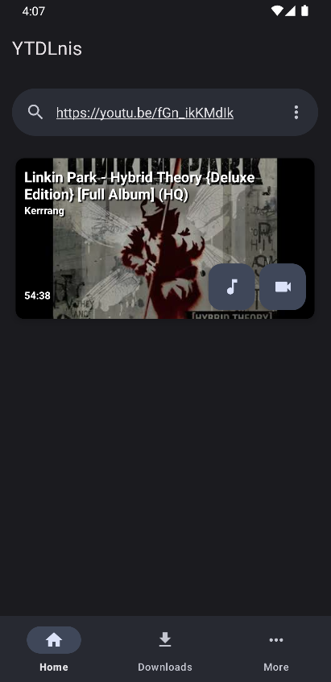
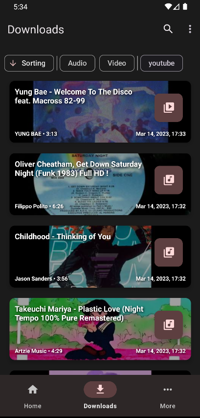
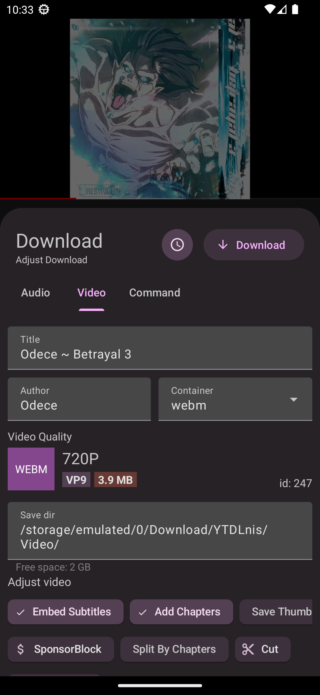
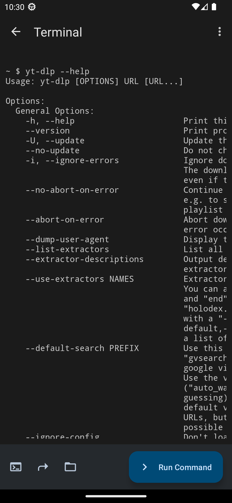
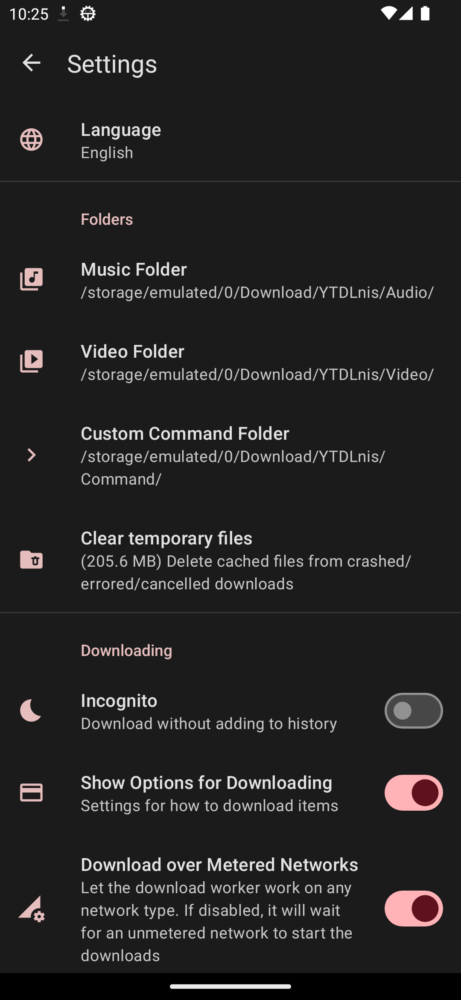
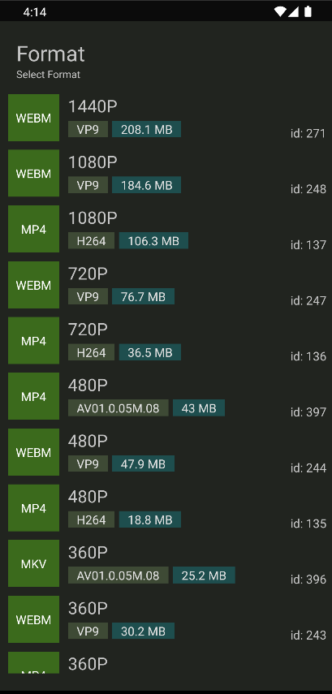
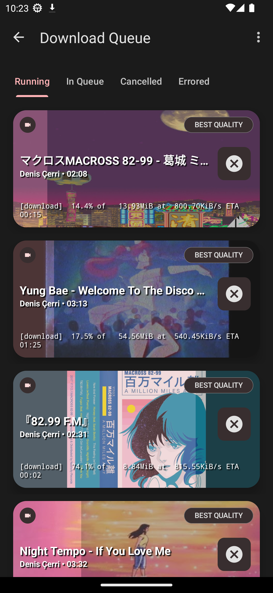
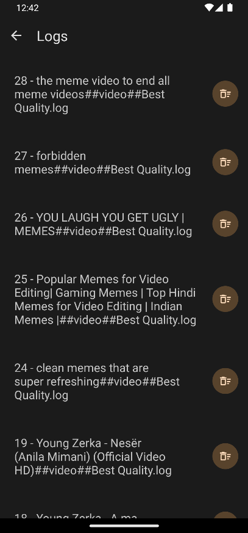
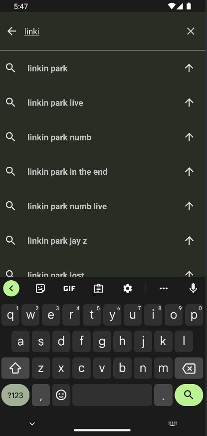

<h1 align="center">
	 <br>
	YTDLnis
</h1>

<div align="center">
	<a href="https://github.com/deniscerri/ytdlnis/blob/main/README.md">English</a>
	&nbsp;&nbsp;| &nbsp;&nbsp;
	Azərbaycanca
</div>

<h3 align="center">
	YTDLnis Android 7.0 və yuxarı üçün yt-dlp istifadə edən pulsuz və açıq mənbəli video/səs yükləyicidir.
</h3>
<h4 align="center">
	Denis Çerri tərəfindən yaradılmışdır
</h4>

<div align="center">

[](https://github.com/deniscerri/ytdlnis/releases/latest)
[](https://f-droid.org/en/packages/com.deniscerri.ytdl)
[](https://android.izzysoft.de/repo/apk/com.deniscerri.ytdl)
[](https://ytdlnis.en.uptodown.com/android/download)


[](https://github.com/deniscerri/ytdlnis/releases) 
[](https://github.com/deniscerri/ytdlnis/releases) 
[](https://hosted.weblate.org/engage/ytdlnis/?utm_source=widget) 
[](https://discord.gg/WW3KYWxAPm) 
[](https://t.me/ytdlnis)
[](https://t.me/ytdlnis updates)
[](https://ytdlnis.org)


### Yalnız yuxarıdakı keçidlər YTDLnis-in yeganə etibarlı mənbələridir. Qalan hər şey mənimlə əlaqəli deyil. 

</div>

## 💡 Xüsusiyyətlər:

- [1000-dən çox veb-saytdan ](https://github.com/yt-dlp/yt-dlp/blob/master/supportedsites.md) səs/video faylları yüklə
- mahnı siyahıların emal et
	- normal yükləmə elementindəki kimi hər pleylist elementin ayrıca redaktə edin.
	- bütün elementlər üçün ümumi format seçin və/yaxud onları video kimi endirəndə çoxlu səs formatı seçin
	- bütün elementlər üçün yükləmə yolu seç
	- bütün elementlər üçün fayl adı şablonun seçin
	- bir kliklə səs/video/fərdi əmr üçün toplu yeniləmə yükləmə növü
- yükləmələri növbəyə qoyun və onları tarix və vaxta görə planlaşdırın
	- eyni vaxtda çoxlu elementi planlaşdıra bilərsiniz
- eyni vaxtda çoxlu elementi yüklə
- fərdi əmrlər və şablonlar istifadə edin və ya quraşdırılan sıxac ilə tam yt-dlp rejiminə keçin
	- Siz şablonları nüsxələyə və bərpa edə bilərsiniz, beləcə dostlarınızla paylaşa bilərsiniz
- Məlumatlar bazası dəstəyi.Hesablarınızla daxil olun və şəxsi/əlçatmaz videoları yüklə, premium formatları kiliddən açın və s.
- vaxt ştampları və video bölmələri əsasında videoları kəsin (Bu yt-dlp xüsusiyyəti orijinal layihədə təcrübidir)
	- limitsiz kəsiklər hazırlaya bilərsiniz
- elementdən SponsorBlock elementlərin təmizlə
	- onları videonuzda bölmələr kimi yerləşdirin 
- titrləri/üst məlumatı/bölmələri yerləşdirmək və s
- başlıq və müəllif kimi üst məlumatı dəyişdir
- onun bölmələrindən asılı olaraq elementi ayrı fayllara bölmək
- müxtəlif yükləmə formatları seçin
- Paylaş menyusundan düz alt kart, tətbiqi açmağa ehtiyac yoxdur 
	- siz txt faylı yarada və onu yeni sətirlə ayrıca bağlantılar/pleylistlər/axtarış sorğuları ilə doldura bilərsiniz və tətbiq onları emal edəcək
- tətbiqdən bağlantı axtar və ya yerləşdir
	- siz eyni vaxtda onları emal etmək üçün axtarışları toplaya bilərsiniz
- problemlər olduqda yükləmələr jurnalı
- ləğv edilən yaxud uğursuz yükləmələri yenidən yüklə
	- yenidən yükləmək üçün sola və silmək üçün sağa sürüşdürmək jestləri istifadə edə bilərsiniz
	- daha çox funksionallıqla yükləmə kartın göstərmək üçün təfərrüatlar vərəqindəki yenidən yükləmə düyməsin uzun klikləyə bilərsiniz
- yükləmə tarixçəsin və ya jurnalları saxlamaq istəmədiyinizdə gizlincə rejimi
- sürətli yükləmə rejimi
	- məlumatı emal etməyi gözləmədən dərhal yüklə. Alt kartı bağla və bu, dərhal başlayacaq
- bitmiş bildirişdən yüklənən faylları aç / paylaş
- əksər yt-dlp xüsusiyyətləri həyata keçirilir, təkliflər arzu ediləndir
- Material You görünüşü
- Tema seçimləri
- Nüsxələmə və bərpa xüsusiyyətləri. (Təqribən, hər şey nüsxələnə bilər)
- MVVM Architecture w/ WorkManager

## 📲 Ekran görüntüləri

<div>













</div>

## 💬 Əlaqə

Müzakirə, elanlar və buraxılışlar üçün [Telegram Kanalımıza](https://t.me/ytdlnis) və ya [Discord](https://discord.gg/WW3KYWxAPm) qoşulun!

## 😇 Töhfə

Əgər töhfə vermək istəyirsinizsə xahiş olunur, [Töhfə vermə](CONTRIBUTING.MD) bölməsin oxuyun.

## 📝 Weblate-də Tərcümə Etməyə Kömək Et
<a href="https://hosted.weblate.org/engage/ytdlnis/">

</a>


<a href="https://hosted.weblate.org/engage/ytdlnis/">

</a>

## 🔑 Paket adın istifadə edərək üçüncü tərəf tətbiqləri əlaqə qurun

Tətbiqin paket adı "com.deniscerri.ytdl"-dir.

## 🔍 Tətbiq imzasın təsdiqləmə

Tətbiq aşağıdakı imzanı ehtiva etməlidir. Github iş axını fəaliyyəti bunu istifadə edir və buraxılışlar onu yenilənən quruluş halına gətirmək üçün buna əsaslanır.
İmza fərqlidirsə, üçüncü tərəf paylayıcınız tətbiqi dəyişdirib. Xahiş olunur, tətbiqi əsil imza ilə istifadə edin.
```
Signer #1 certificate DN: CN=Denis Cerri, OU=Personal, O=Personal, L=Albania, ST=Albania, C=AL
Signer #1 certificate SHA-256 digest: 263645cb5272eb290759fe1f59149ae24df6ce171e9f6666eead981d3fc64c95
Signer #1 certificate SHA-1 digest: 2fec9c2fcef68d29a60857e185c795fec5f56fb6
Signer #1 certificate MD5 digest: 429d0c6315d2f99650f66cc44cf5a794
```


## 🤖 İntent-lər istifadə edərək üçüncü tərəf tətbiqləri ilə əlaqə qurun

Siz istifadəçi toxunuşu olmadan yükləmələri həyata keçirmək üçün tətbiqə əmrlər göndərmək niyyətin (İntent) istifadə edə bilərsiniz. Qəbul edilən dəyişgənliklər:

<b>TYPE</b> -> bu ola bilər: səs,video,əmr <br/>
<b>BACKGROUND</b> -> bu ola bilər: true,false. Əgər bu true olarsa, tətbiq istənilən halda yükləmə kartını göstərməyəcək və yükləməni arxa planda həyata keçirəcək <br/>

### Tasker ilə fonda səs elementin yüklənilməsi nümunəsi
1. Göndərmə Intent tapşırığı yaradın 
2. Action (Fəaliyyət): android.intent.action.SEND
3. Cat: İlkin (default)
4. Mime Type: text/*
5. Əlavə (Extra): android.intent.extra.TEXT:url ("url" əvəzinə yükləmək istədiyiniz videonun URL-ni yazın)
6. Əlavə(Extra): TYPE:audio
7. Əlavə(Extra): BACKGROUND:true

## 📄 Lisenziya

[GNU GPL v3.0](https://github.com/deniscerri/ytdlnis/blob/main/LICENSE)

GPLv3 lisenziyası ilə lisenziyalaşdırılan mənbə kodu istisna olmaqla, bütün digər tərəflərə "YTDLnis" adın yükləyici tətbiq kimi istifadə etmək qadağandır və eynisi onun törəmələri üçün də keçərlidir. Törəmələrə fork-lar və qeyri-rəsmi quruluşlar daxildir, lakin bunlarla məhdudlaşmır.

## 😁 İanə Edin


[](https://www.buymeacoffee.com/deniscerri)

## 🙏 Təşəkkürlər

- [yt-dlp](https://github.com/yt-dlp/yt-dlp) və bu aləti mümkün etmək üçün töhfəçiləri. Bunsuz bu tətbiq mövcud olmazdı.
- [youtubedl-android](https://github.com/yausername/youtubedl-android) yt-dlp-ni Android-ə köçürmək üçün
- [dvd](https://github.com/yausername/dvd) Sizə youtubedl-android alətin göstərmək üçün
- [seal](https://github.com/JunkFood02/Seal) müəyyən dizayn elementləri və xüsusiyyətləri üçün bu tətbiqdə də istifadə etmək istədim
- [decipher3114](https://github.com/decipher3114) tətbiq simvolu üçün

və bir çox başqa internet forum yad adamlar.
