<h1 align="center">
	  
	YTDLnis
</h1>

	<a href="https://github.com/deniscerri/ytdlnis/blob/main/README.md">English</a>
	&nbsp;&nbsp;| &nbsp;&nbsp;
	Português

<h3 align="center">
	YTDLnis é um aplicativo gratuito e de código aberto para baixar vídeos/áudios usando yt-dlp disponível para o Android 7.0 e superior.
</h3>

 
 
 
 

## 💡 Funcionalidades:

- Mais de <a href="https://github.com/yt-dlp/yt-dlp/blob/master/supportedsites.md">1.000 sites suportados</a>
- Baixe Playlists
	- Edite cada item da playlist em um item de download normal.
	- Selecione um formato comum para todos os itens e/ou selecione vários formatos de áudio caso você esteja baixando-os como um vídeo
	- Selecione um caminho de download para todos os itens
	- Selecione um modelo de nome de arquivo para todos os itens
	- Atualização em lote do tipo de download para áudio/vídeo/comando personalizado em um clique
- Enfileirar downloads e programá-los por data e hora
	- Você também pode agendar vários itens ao mesmo tempo
- Faça o download de vários itens ao mesmo tempo
- Use comandos e modelos personalizados ou use o modo yt-dlp completo com um terminal integrado
	- Você pode fazer backup e restaurar modelos para poder compartilhar com seus amigos
- Suporte para COOKIES. Faça login com suas contas e baixe vídeos privados/indisponíveis, desbloqueie formatos premium, etc.
- Cortar vídeos com base em registros de data e hora e capítulos de vídeo (esse recurso do yt-dlp é experimental)
	- Você pode fazer cortes ilimitados
- Remover patrocinadores do vídeo (SponsorBlock)
	- Incorpore-os como capítulos em seu vídeo
- Incorporar legendas/metadados/capítulos etc…
- Modificar metadados como título e autor
- Dividir o item em arquivos separados dependendo de seus capítulos
- Selecione diferentes formatos de download
- Use o botão de compartilhar para baixar, sem necessidade de abrir o aplicativo
	- Você pode criar um arquivo txt e preenchê-lo com links/playlists/consultas de pesquisa separados por uma nova linha e o aplicativo irá baixar eles
- Pesquise ou insira o link do vídeo/áudio no aplicativo
	- Você pode empilhar pesquisas para poder processá-las ao mesmo tempo
- Registrar downloads em caso de problemas
- Baixar novamente downloads cancelados ou com falha
	- Você pode usar gestos para deslizar para a esquerda para baixar novamente e para a direita para excluir
	- Você pode clicar longamente no botão de download novamente na folha de detalhes para mostrar o cartão de download para obter mais funcionalidades
- Modo de navegação anônima quando você não deseja salvar um histórico ou registros de download
- Modo de download rápido
	- O download é feito imediatamente, sem a necessidade de aguardar o processamento dos dados. Desligue o cartão inferior e ele será iniciado instantaneamente
- Abrir/Compartilhar arquivos diretamente da notificação após a conclusão do download
- A maioria dos recursos do yt-dlp são implementados, sugestões são bem-vindas
- Interface "Material You"
- Opções de temas
- Backup e Restauração (Quase tudo pode ser copiado)
- Arquitetura MVVM com WorkManager

## 📲 Capturas de tela

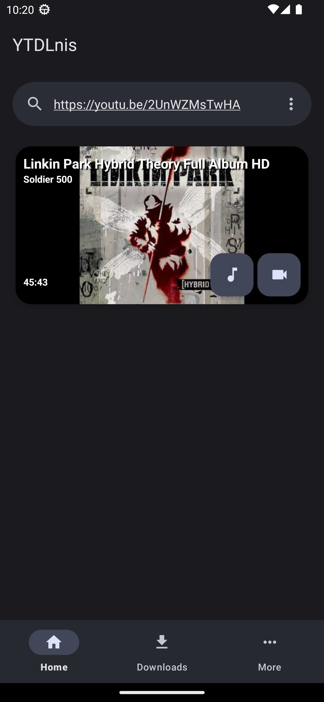

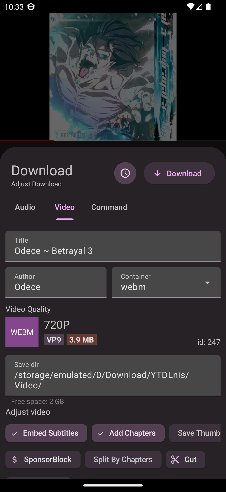
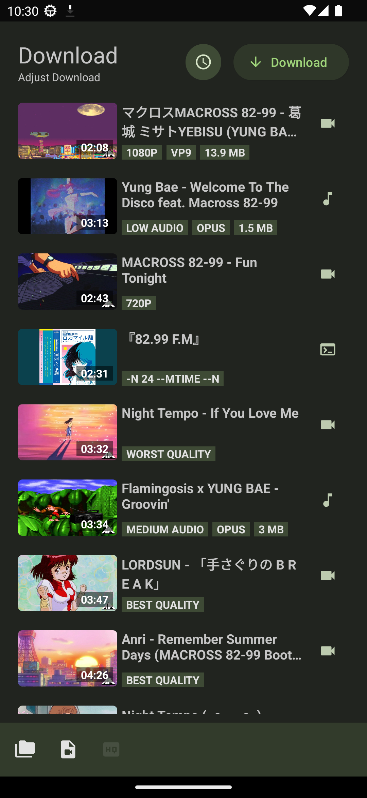
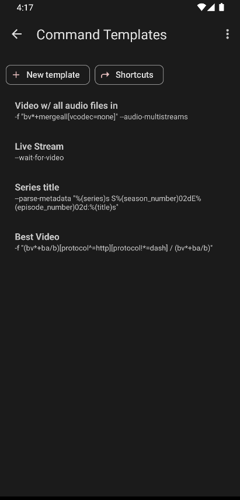
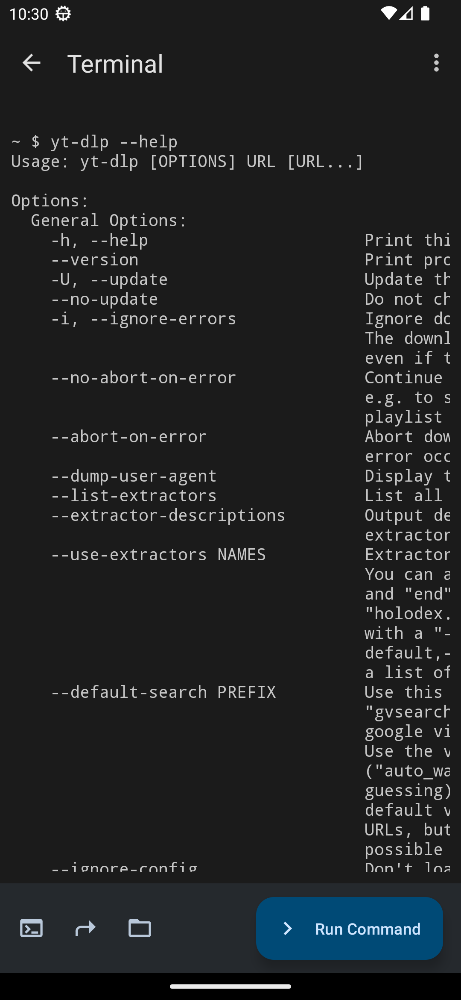
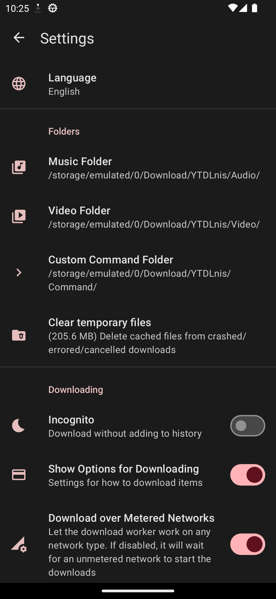
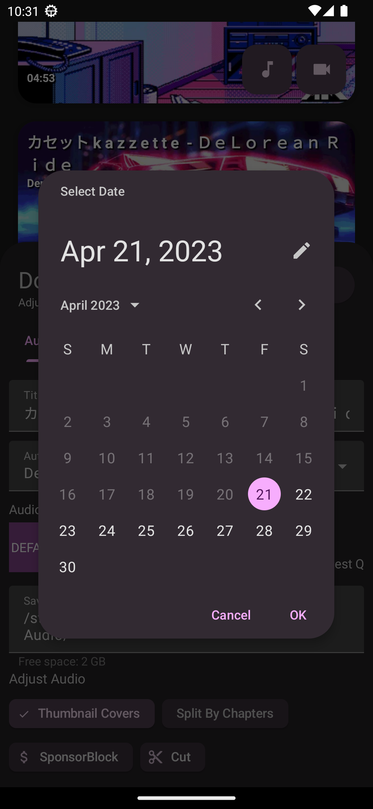
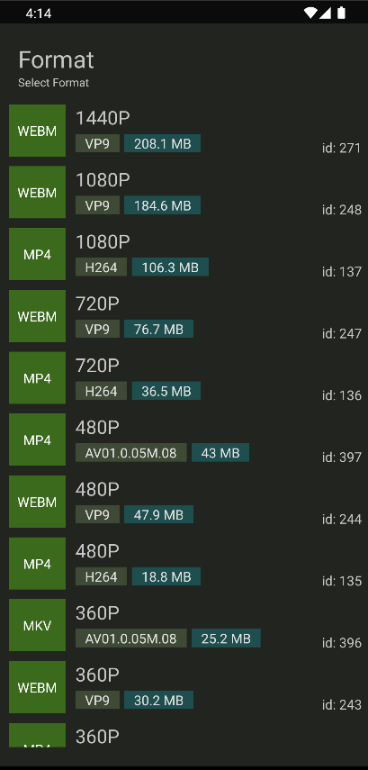
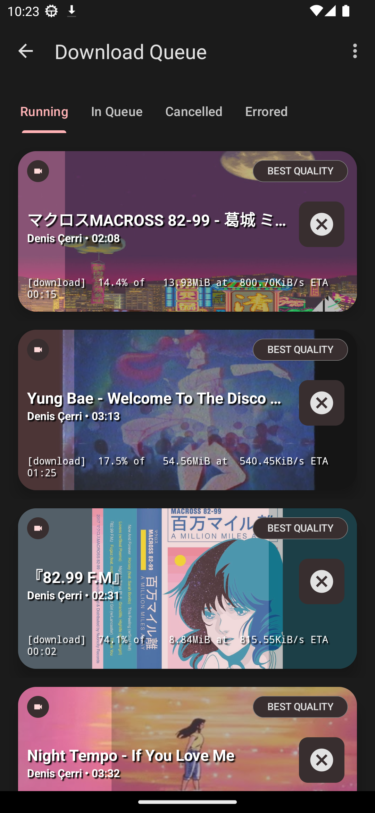
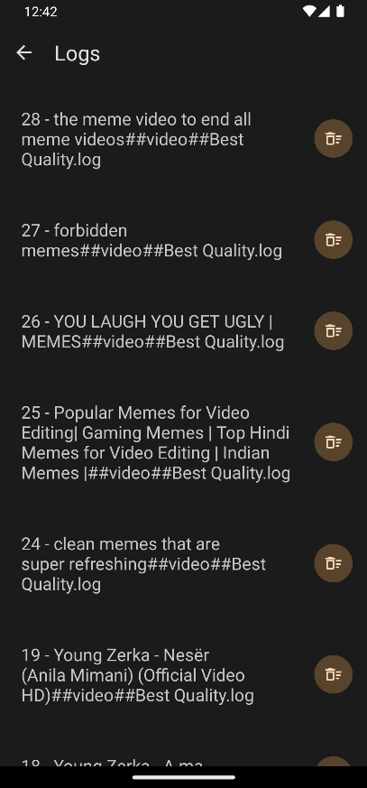
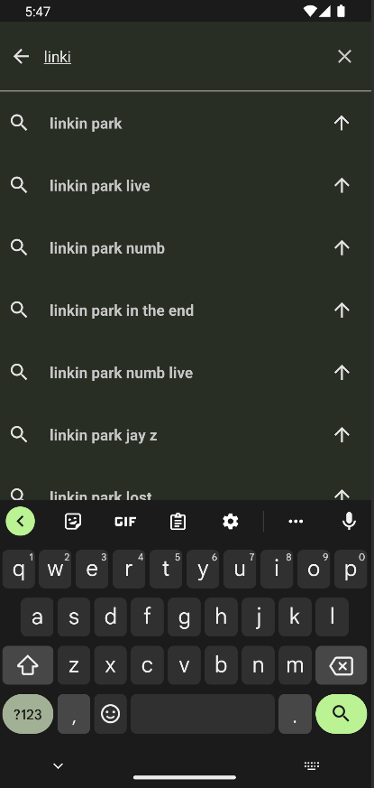
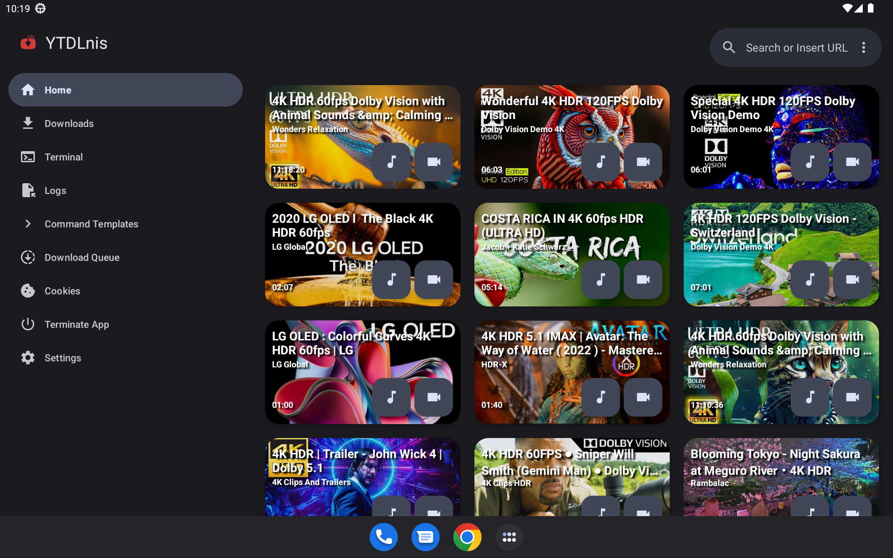

## 💬 Contato

Junte-se ao nosso [Canal no Telegram](https://t.me/ytdlnis) ou no [Discord](https://discord.gg/WW3KYWxAPm) para discussão, anúncios e lançamentos!

## 🔑 Conecte-se com ReVanced

O nome do pacote do aplicativo é "com.deniscerri.ytdl"

## 📝 Ajude a traduzir no Weblate

## 😇 Contribuição

Se você gostaria de contribuir. Por favor, leia a seção [Contribuição](CONTRIBUTING.MD).

## 📄 Licença

[GNU GPL v3.0](https://github.com/deniscerri/ytdlnis/blob/main/LICENSE)

⚠️  Aviso  

Exceto para o código-fonte licenciado sob a licença GPLv3, todas as outras partes estão proibidas de usar o nome ‘YTDLnis’ como aplicativo de download, e o mesmo se aplica a seus derivados. Os derivados incluem, mas não estão limitados a forks e construções não oficiais.

## 🙏 Obrigado

- [yt-dlp](https://github.com/yt-dlp/yt-dlp) e seus colaboradores por tornarem esta ferramenta possível. Sem ele este aplicativo não existiria.
- [youtubedl-android](https://github.com/yausername/youtubedl-android) por disponibilizar o yt-dlp para o Android
- [dvd](https://github.com/yausername/dvd) por mostrar como implementar o youtubedl-android
- [seal](https://github.com/JunkFood02/Seal) por certos elementos e recursos de design que eu também queria usar neste aplicativo
- [decipher3114](https://github.com/decipher3114) por disponibilizar o ícone do aplicativo

e muitos outros estranhos do fórum da Internet.
