<h1 align="center">
	 <br>
	YTDLnis
</h1>

<div align="center">
	<a href="https://github.com/deniscerri/ytdlnis/blob/main/README.md">English</a>
	&nbsp;&nbsp;| &nbsp;&nbsp;
        Русский
</div>

<h3 align="center">
	YTDLnis — бесплатное приложение с открытым исходным кодом для загрузки видео и аудио на основе yt-dlp для Android 7.0 и новее.
</h3>
<h4 align="center">
	Создано Denis Çerri
</h4>

<div align="center">

[](https://github.com/deniscerri/ytdlnis/releases/latest)
[](https://f-droid.org/en/packages/com.deniscerri.ytdl)
[](https://apt.izzysoft.de/packages/com.deniscerri.ytdl)
[](https://ytdlnis.en.uptodown.com/android/download)


[](https://github.com/deniscerri/ytdlnis/releases) 
[](https://github.com/deniscerri/ytdlnis/releases) 
[](https://hosted.weblate.org/engage/ytdlnis/?utm_source=widget) 
[](https://discord.gg/WW3KYWxAPm) 
[](https://t.me/ytdlnis)
[](https://t.me/ytdlnis_updates)
[](https://ytdlnis.org)


### Только перечисленные выше ссылки являются единственными официальными источниками YTDLnis. Всё остальное не имеет ко мне отношения.

</div>

## 💡 Возможности:

- Загрузка аудио- и видеофайлов с более чем <a href="https://github.com/yt-dlp/yt-dlp/blob/master/supportedsites.md">1000 сайтов</a>
- Обработка списков воспроизведения
	- Возможность редактировать каждый элемент списка так же, как и обычный элемент загрузки
	- Выбор общего формата для всех элементов и/или нескольких аудиоформатов, если файлы загружаются в виде видео
	- Выбор пути загрузки для всех элементов
	- Выбор шаблона имени файла для всех элементов
	- Массовое изменение типа загрузки на аудио, видео или пользовательскую команду одним нажатием
- Постановка загрузок в очередь и планирование по дате и времени
	- Также можно запланировать сразу несколько элементов
- Одновременная загрузка нескольких элементов
- Использование пользовательских команд и шаблонов либо работа с yt-dlp через встроенный терминал
	- Для шаблонов можно создавать резервные копии и восстанавливать их, чтобы делиться ими с друзьями
- Поддержка файлов cookie. Авторизуйтесь в своих учётных записях, чтобы загружать закрытые и недоступные видео, открывать премиум-форматы и так далее
- Разбиение видео по таймкодам и главам (экспериментальная функция yt-dlp)
	- Количество разрезов не ограничено
- Удаление элементов SponsorBlock из загружаемых файлов
	- Возможность встроить их в видео в качестве глав
- Встраивание субтитров, метаданных, глав и других данных
- Изменение метаданных, например названия и автора
- Разделение элемента на отдельные файлы в соответствии с его главами
- Выбор различных форматов загрузки
- Нижняя карточка прямо из меню «Поделиться», без необходимости открывать приложение
	- Можно создать текстовый файл со списком ссылок, списков воспроизведения или поисковых запросов, разделённых переводом строки, — приложение обработает их
- Поиск и вставка ссылок непосредственно в приложении
	- Можно объединять поисковые запросы, чтобы обрабатывать их одновременно
- Ведение журнала загрузок для диагностики проблем
- Повторная загрузка отменённых или неудачных загрузок
	- Жесты: свайп влево — повторная загрузка, вправо — удаление
	- Долгое нажатие кнопки повторной загрузки в панели сведений открывает карточку загрузки с дополнительными возможностями
- Режим инкогнито, если не нужно сохранять историю загрузок и журналы
- Быстрый режим загрузки
	- Загрузка начинается сразу, без ожидания обработки данных. Отключите нижнюю карточку — и загрузка запустится мгновенно
- Открытие и передача загруженных файлов прямо из уведомления о завершении
- Реализована большая часть функций yt-dlp; предложения приветствуются
- Интерфейс Material You
- Возможности настройки темы
- Создание и восстановление резервных копий
- Архитектура MVVM с WorkManager

## 🧩 Поддержка плагинов

YTDLnis управляет плагинами, благодаря чему пользователи могут свободно изменять версии компонентов, таких как:
- Python
- Среды выполнения JavaScript (NodeJS, Deno)
- FFmpeg
- Aria2c

Пакеты ytdlnis можно установить из репозитория [ytdlnis-packages](https://github.com/deniscerri/ytdlnis-packages/) или через раздел обновления в приложении.
<br>Дополнительные сведения см. в файле README соответствующего репозитория.

## 📲 Снимки экрана

<div>
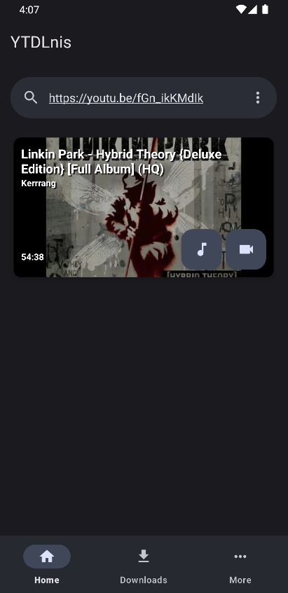
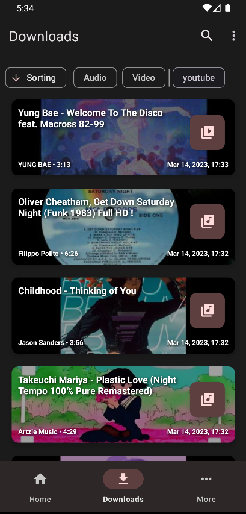
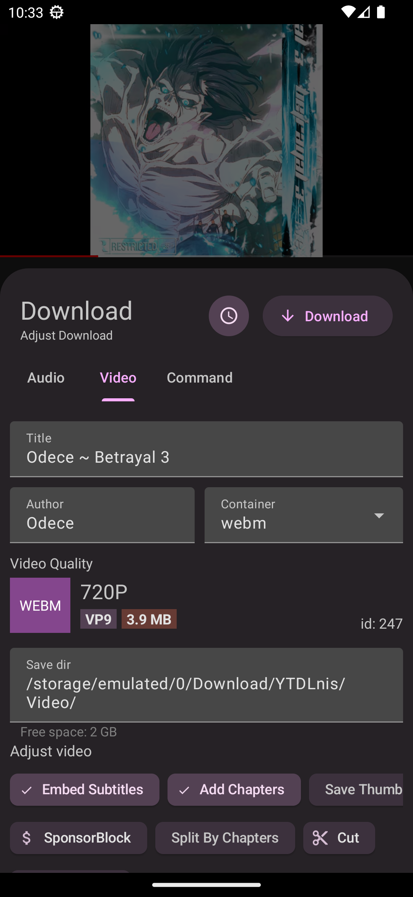
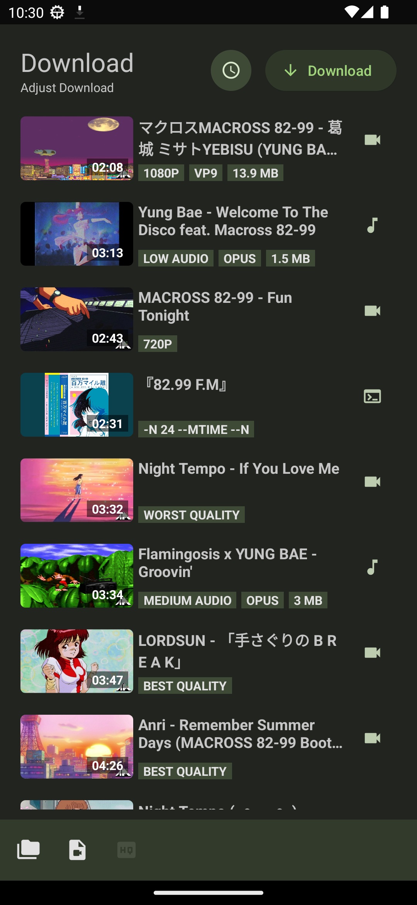
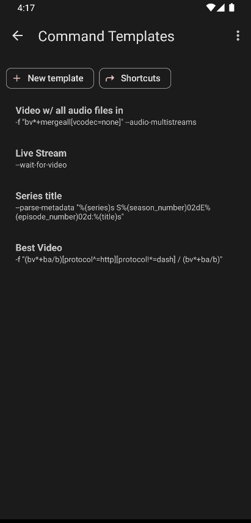
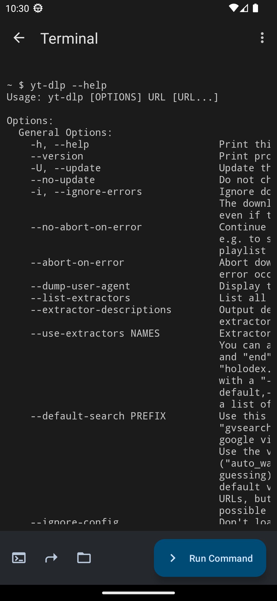
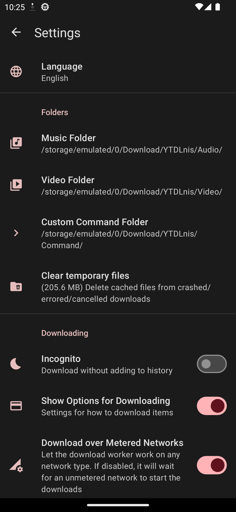
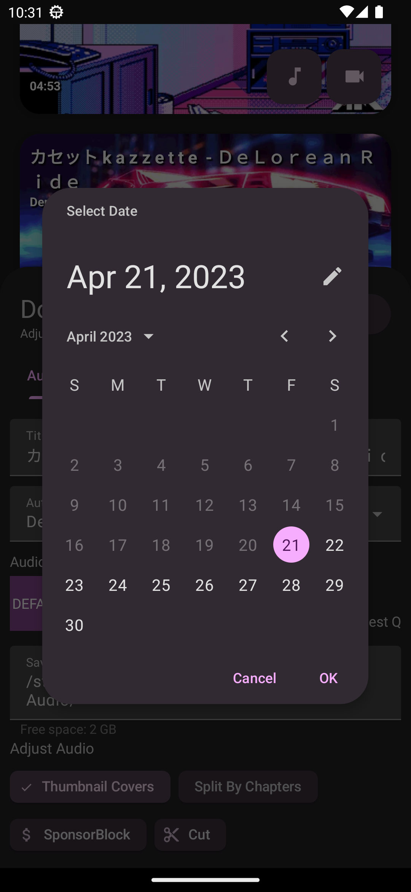
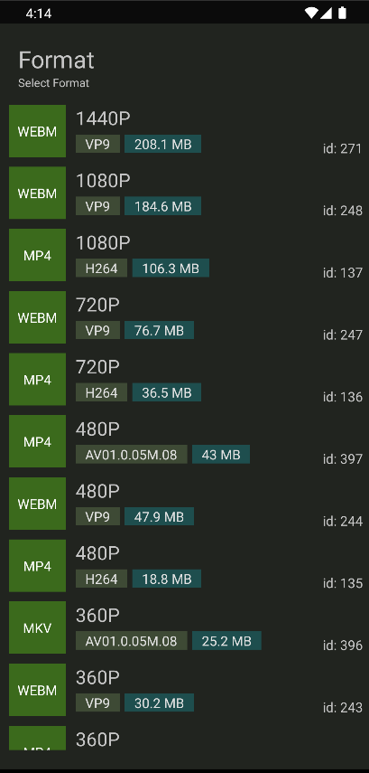
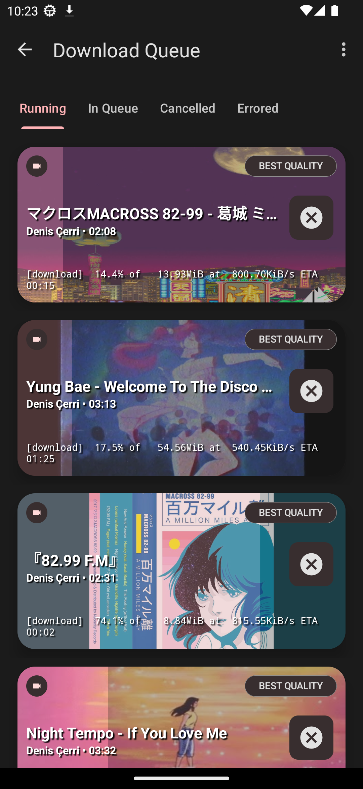
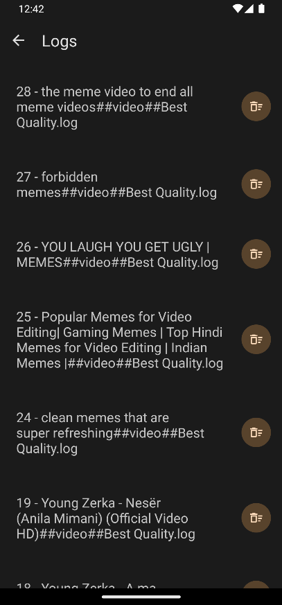
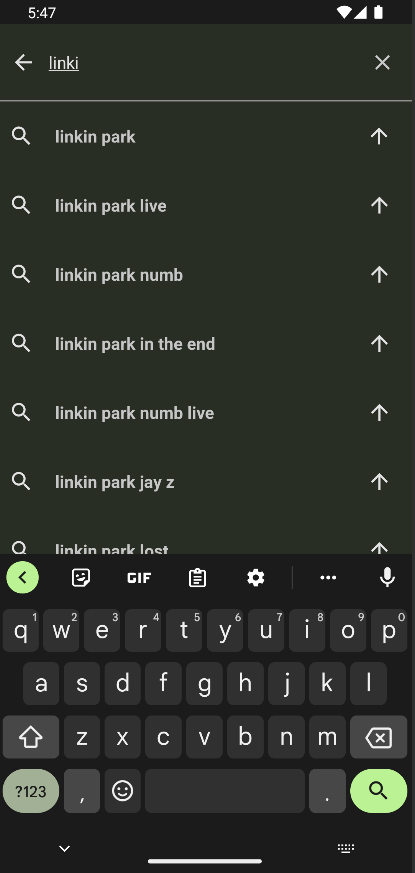
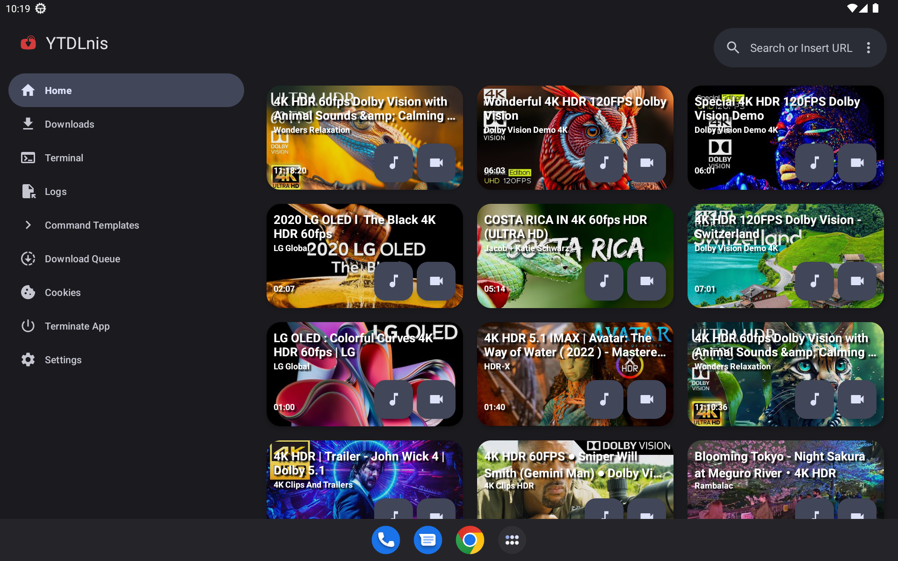
</div>

## 💬 Контакты

Присоединяйтесь к нашему [Discord](https://discord.gg/WW3KYWxAPm) или [Telegram-каналу](https://t.me/ytdlnis): там публикуются объявления, ведутся обсуждения и выходят релизы.

## 😇 Участие в разработке

Если вы хотите внести вклад, ознакомьтесь с разделом [участия в разработке](CONTRIBUTING.MD).

## 📝 Помогите с переводом на Weblate
<a href="https://hosted.weblate.org/engage/ytdlnis/">

</a>


<a href="https://hosted.weblate.org/engage/ytdlnis/">

</a>

## 🔑 Интеграция с сторонними приложениями по имени пакета

Имя пакета приложения: «com.deniscerri.ytdl».

## 🔍 Проверка подписи приложения

Приложение должно содержать приведённую ниже подпись. Она используется в процедуре сборки GitHub Actions, и релизы формируются на её основе, что обеспечивает воспроизводимость сборки.
Если подпись отличается, значит, сторонний дистрибьютор изменил приложение. Используйте приложение с исходной подписью.
```
Signer #1 certificate DN: CN=Denis Cerri, OU=Personal, O=Personal, L=Albania, ST=Albania, C=AL
Signer #1 certificate SHA-256 digest: 263645cb5272eb290759fe1f59149ae24df6ce171e9f6666eead981d3fc64c95
Signer #1 certificate SHA-1 digest: 2fec9c2fcef68d29a60857e185c795fec5f56fb6
Signer #1 certificate MD5 digest: 429d0c6315d2f99650f66cc44cf5a794
```


## 🤖 Интеграция с сторонними приложениями с помощью интентов

С помощью интентов можно передавать команды в приложение и запускать загрузки без участия пользователя.
Допустимые переменные:

<b>TYPE</b> -> принимает значения: audio, video, command <br/>
<b>BACKGROUND</b> -> принимает значения: true, false. Если указано true, карточка загрузки отображаться не будет, а загрузка будет выполнена в фоновом режиме <br/>

### Пример фоновой загрузки аудиоэлемента с помощью Tasker
1. Создайте задачу Send Intent
2. Action: android.intent.action.SEND
3. Cat: Default
4. Mime Type: text/*
5. Extra: android.intent.extra.TEXT:url (вместо "url" укажите URL видео, которое необходимо загрузить)
6. Extra: TYPE:audio
7. Extra: BACKGROUND:true

## 📄 Лицензия

[GNU GPL v3.0](https://github.com/deniscerri/ytdlnis/blob/main/LICENSE)

За исключением исходного кода, распространяемого по лицензии GPLv3, иным лицам запрещено использовать название «YTDLnis» в качестве приложения для загрузки; то же касается производных от него продуктов. Производными считаются, в частности, форки и неофициальные сборки, однако этот список не является исчерпывающим.

## 😁 Поддержать проект


[](https://www.buymeacoffee.com/deniscerri)

## 🙏 Благодарности

- [decipher3114](https://github.com/decipher3114) — значок приложения
- [dvd](https://github.com/yausername/dvd) — пример реализации на базе youtubedl-android
- [seal](https://github.com/JunkFood02/Seal) — отдельные элементы оформления и функции, которые я хотел видеть в этом приложении на этапе начала разработки
- [youtubedl-android](https://github.com/yausername/youtubedl-android) — порт yt-dlp на Android
- [yt-dlp](https://github.com/yt-dlp/yt-dlp) и его участники — без них этот инструмент не был бы возможен, а приложение не существовало бы


и многим другим, в частности участникам проекта.
