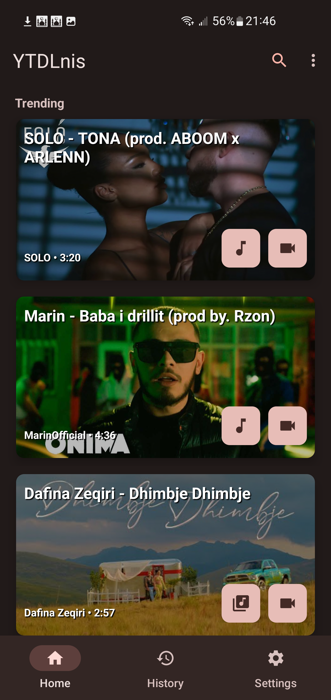
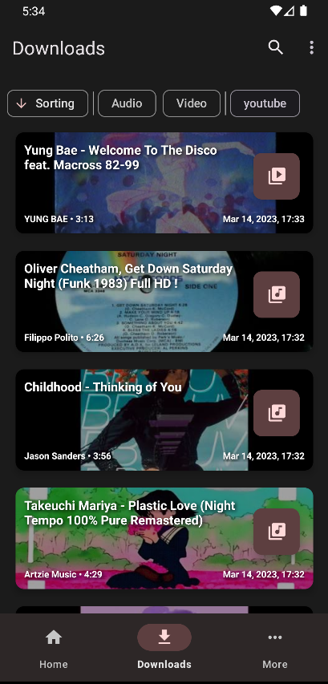
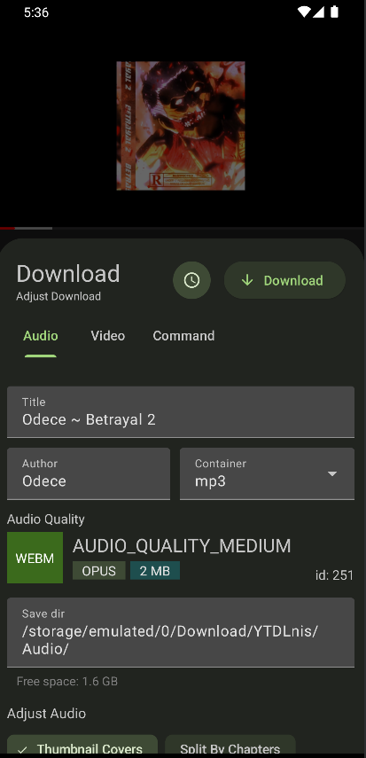
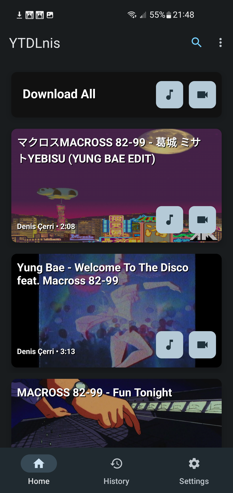
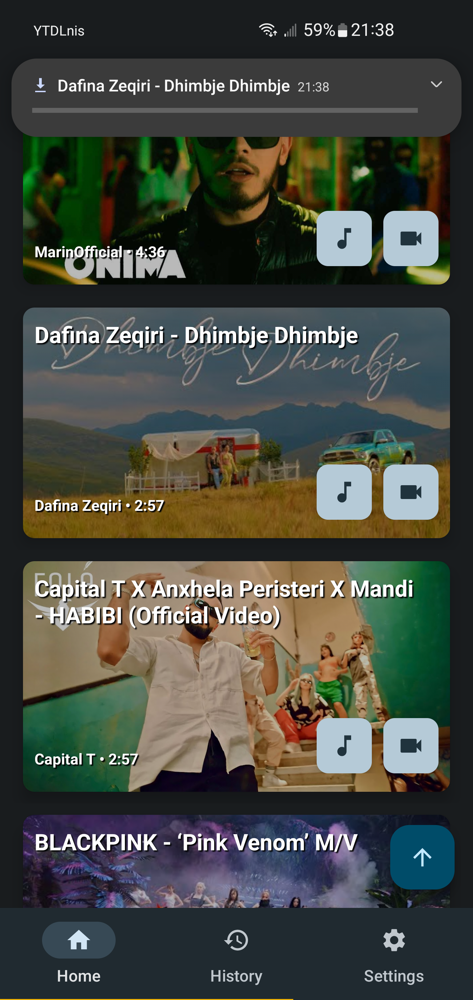
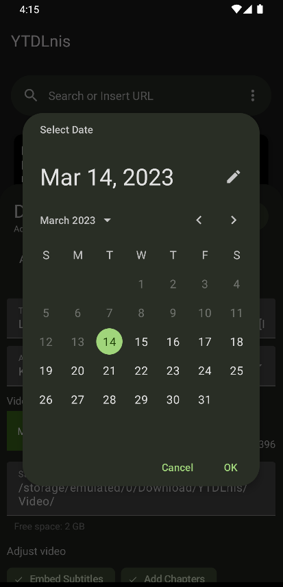

<h1 align="center">
	  
	YTDLnis
</h1>

<h3 align="center">
	YTDLnis is a free and open source video/audio downloader using yt-dlp for Android 6.0 and above.
</h3>

 
 
 
 
 
 

## Features:

- download audio/video files from more than <a href="https://github.com/yt-dlp/yt-dlp/blob/master/supportedsites.md">1000 websites</a>
- download playlists or multi select items
- queue downloads and schedule them by date and time
- use custom commands and templates or go full terminal mode
- remove sponsorblock chapters
- embed subtitles/metadata/chapters etc
- modify metadata such as title and author
- split item into separate files depending on its chapters
- select different download formats
- process multiple items before download
- quick share card right from the share menu 
- search or insert a link from the app
- log downloads
- re-download cancelled or failed downloads
- incognito mode when you don't want to save a download history
- download multiple items at the same time
- change preferred audio/video formats and qualities
- Material You interface
- MVVM Architecture w/ WorkManager
- easy to use :)

## Screenshots

## Connect with YouTube Revanced

The App's package name is com.deniscerri.ytdl

## Help Translate on Weblate

##Contributing.md

Before reading, you may know what yt-dlp is and what it does. In short, it's a CLI (Command Line Interface) program written in python, which lets you download videos from 1000+ websites.

For bug reports and feature requests, please search in issues first (including the closed ones). If there're no duplicates, feel free to submit an issue with an issue template.

We'll probably ignore and close your issue if it's not using the existing templates or doesn't contain sufficient description.

For questions or any other ideas to improve, you can join or start a new discussion.

Bug Report
When submitting a bug report, please make sure your issue contains enough information for reproducing the problem, including the options or the custom command being used, the link to the video, and other fields in the issue template.

Feature Request
YTDlnis is and will remain a simple GUI for yt-dlp, providing most of the functionality of yt-dlp as is, without modifications. Thus, we'll not take requests for features that yt-dlp does not support.

The app has two download modes:

General mode: Save as audio, download playlist, and many other options that can be used individually or combined for normal download tasks. Once the download is complete, YTDlnis will scan the files into the system media library, and store them in the download history.
Custom command mode: For advanced usage of yt-dlp, a user can create and store multiple command templates in the app, then select and use one of them directly to execute the yt-dlp command like in a terminal. In this mode, all of the GUI options and features in the general mode will be disabled.
Since most of the functions can be implemented in custom command mode, the "feature request" would be treated as adding a shortcut to the general mode. However, not all feature requests will be accepted and implemented in the app. Why not add an option for that?

Pull Request
If you wish to contribute to the project by submitting code directly, please first leave a comment under the relevant issue or file a new issue, describe the changes you are about to make.

To avoid multiple pull requests resolving the same issue, let others know you are working on it by saying so in a comment, or ask the issue to be assigned to yourself.

Building From Source
Fork this project, import and compile it with the latest version of Android Studio Canary.

## License

[GNU GPL v3.0](https://github.com/deniscerri/ytdlnis/blob/main/LICENSE)

Warning !!  
Except for the source code licensed under the GPLv3 license, all other parties are prohibited from using the 'YTDLnis' name as a downloader app, and the same is true for its derivatives. Derivatives include but are not limited to forks and unofficial builds.

## Thanks

- [yt-dlp](https://github.com/yt-dlp/yt-dlp) and its contributors for making this tool possible. Without it this app wouldn't exist.
- [youtubedl-android](https://github.com/yausername/youtubedl-android) for porting yt-dlp to android
- [dvd](https://github.com/yausername/dvd) for showing how to implement youtubedl-android
- [seal](https://github.com/JunkFood02/Seal) for certain design elements and features i wanted to use aswell in this app
- [decipher3114](https://github.com/decipher3114) for the app icon

and alot of other internet forum strangers.

