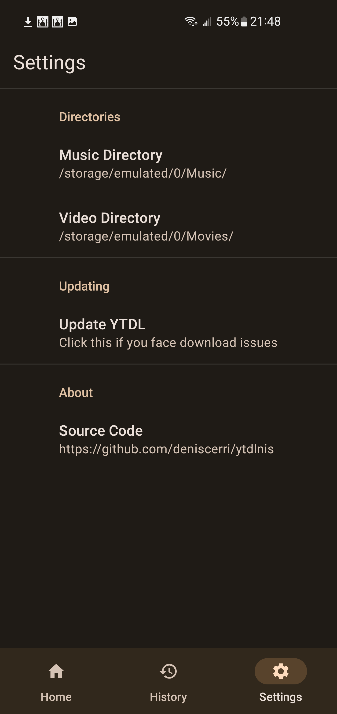

<h1 align="center">
	ytdlnis
</h1>

	Android App for downloading audio and videos using yt-dlp

	Created as a project for the class, Mobile Programming. Continued to update it because why not.

## Download

[Get Latest Release Here](https://github.com/deniscerri/ytdlnis/releases/)

## Features:

- download audio and video files
- download full playlists
- download selected videos on a list and add to a queue
- use custom download paths for each format
- remove non music parts from youtube audio files
- embed subtitles on videos
- add chapters to youtube videos by using sponsorblock chapters 
- select different download formats
- share any yt-dlp compatible link into the app and start downloading
- foreground download services which work even if app is cleared from recents and updates ui when u go back
- search from the app
- material you interface
- really easy to use
- run terminal commands for more flexibility

## Screenshots

## License

[GNU GPL v3.0](https://github.com/deniscerri/ytdlnis/blob/main/LICENSE)

## Thanks

- [yt-dlp](https://github.com/yt-dlp/yt-dlp) and its contributors for making this tool possible. Without it this app wouldn't exist.
- [youtubedl-android](https://github.com/yausername/youtubedl-android) for porting yt-dlp to android 
- [dvd](https://github.com/yausername/dvd) for showing how to implement youtubedl-android
- [seal](https://github.com/JunkFood02/Seal) for certain design elements and features i wanted to use aswell in this app

and alot of other internet forum strangers.
